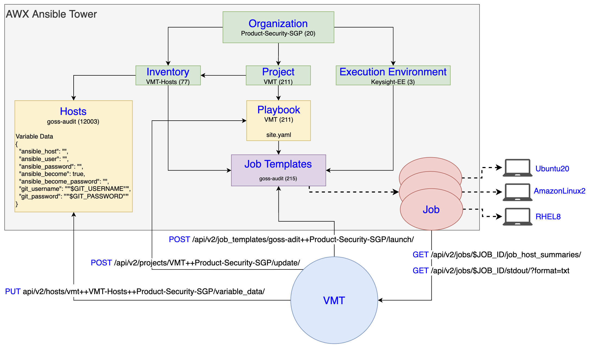
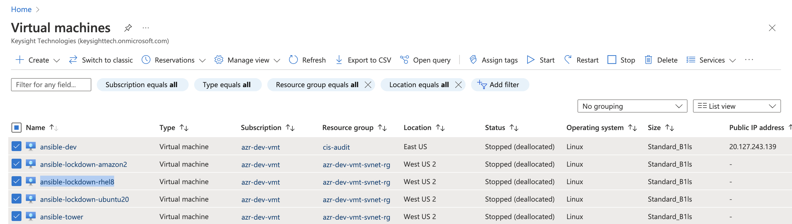

# ansible-automation-pst
## AWX Project Overview

- The metadata of our main components (obtained by GET request to `api/v2/`) is stored in [./metadata](./metadata) directory
- For a full list of supported REST API, see official Ansible Tower documentation [here](https://docs.ansible.com/ansible-tower/latest/html/towerapi/api_ref.html)

## Demo
### Explore our Environment
- We prepare 5 Azure VMs for our demo:
  
  - `ansible-dev` (with a public IP) our access point to Ansible management node via ssh: `$ ssh tower`
  - `ansible-tower` simulate our Ansible management node, where I will be sending all my REST API request
    - `keysight.cer` (PEM format, base64 encoded) in the home directory `/home/CCCS-audit22/` as the root certificate 
    used to provide TLS for `awx.it.keysight.com`
    - environment variables `GIT_USERNAME` and `GIT_PASSWORD` as credentials to `bitbucket.it.keysight.com`
  - `ansible-lockdown-ubuntu20`, `ansible-lockdown-amazon2`, `ansible-lockdown-rhel8` 3 hosts of 3 main OSes that we 
will demo our goss audit on (require access to `bitbucket.it.keysight.com` and specifically `ansible-lockdown-audit` repos)
    - `ansible-lockdown-ubuntu20`:
      - ip address: `10.244.33.199`
      - username: `Ubuntu-20p04`
      - password: `Ubuntu-20p04`
    - `ansible-lockdown-amazon2`
      - ip address: `10.244.33.200`
      - username: `AmazonLinux-2`
      - password: `AmazonLinux-2`
    - `ansible-lockdown-rhel8`
      - ip address: `10.244.33.201`
      - username: `RHatELinux-8`
      - password: `RHatELinux-8`
### Execution
>
> N.B. All `curl` commands are executed in the home directory `/home/CCCS-audit22/` of `ansible-tower` VM
> 
- `POST` To sync our AWX project after updating bitbucket repository
```shell
curl -s --cacert keysight.cer -H "Authorization: Bearer $AWXTOKEN" https://awx.it.keysight.com/api/v2/projects/VMT++Product-Security-SGP/update/ -X POST
```
- `PUT` Update Variable Data for each host (job template should be launched
after each update)
```shell
curl -s --cacert keysight.cer -H "Authorization: Bearer $AWXTOKEN" https://awx.it.keysight.com/api/v2/hosts/vmt++VMT-Hosts++Product-Security-SGP/variable_data/ \
  -X PUT -H "Content-Type: application/json" \
  --data '{
    "ansible_host": "10.244.33.199",
    "ansible_user": "Ubuntu-20p04",
    "ansible_password": "Ubuntu-20p04",
    "ansible_become": true,
    "ansible_become_password": "Ubuntu-20p04",
    "git_username": "'"$GIT_USERNAME"'",
    "git_password": "'"$GIT_PASSWORD"'"
  }' \
  -o /dev/null
  
curl -s --cacert keysight.cer -H "Authorization: Bearer $AWXTOKEN" https://awx.it.keysight.com/api/v2/hosts/vmt++VMT-Hosts++Product-Security-SGP/variable_data/ \
  -X PUT -H "Content-Type: application/json" \
  --data '{
    "ansible_host": "10.244.33.200",
    "ansible_user": "AmazonLinux-2",
    "ansible_password": "AmazonLinux-2",
    "ansible_become": true,
    "ansible_become_password": "AmazonLinux-2",
    "git_username": "'"$GIT_USERNAME"'",
    "git_password": "'"$GIT_PASSWORD"'"
  }' \
  -o /dev/null
  
curl -s --cacert keysight.cer -H "Authorization: Bearer $AWXTOKEN" https://awx.it.keysight.com/api/v2/hosts/vmt++VMT-Hosts++Product-Security-SGP/variable_data/ \
  -X PUT -H "Content-Type: application/json" \
  --data '{
    "ansible_host": "10.244.33.201",
    "ansible_user": "RHatELinux-8",
    "ansible_password": "RHatELinux-8",
    "ansible_become": true,
    "ansible_become_password": "RHatELinux-8",
    "git_username": "'"$GIT_USERNAME"'",
    "git_password": "'"$GIT_PASSWORD"'"
  }' \
  -o /dev/null
```
- `POST` Launch job template and store `JOB_ID`
```
export JOB_ID=$(curl -s --cacert keysight.cer -H "Authorization: Bearer $AWXTOKEN" https://awx.it.keysight.com/api/v2/job_templates/goss-adit++Product-Security-SGP/launch/ -X POST | jq ".id")
```
- `GET` Check job status and obtain goss audit result
```
# Check job status
curl -s --cacert keysight.cer -H "Authorization: Bearer $AWXTOKEN" https://awx.it.keysight.com/api/v2/jobs/$JOB_ID/job_host_summaries/ | jq ".results[0].summary_fields.job.status"

# View ansible progress in colored ansi format
curl -s --cacert keysight.cer -H "Authorization: Bearer $AWXTOKEN" https://awx.it.keysight.com/api/v2/jobs/$JOB_ID/stdout/?format=ansi

# Get audit result
curl -s --cacert keysight.cer -H "Authorization: Bearer $AWXTOKEN" https://awx.it.keysight.com/api/v2/jobs/$JOB_ID/stdout/?format=txt |
  tr -d '\\' | sed 's/"rn//g' | sed 's/rn"//g' | # trim escape characters in AmazonLinux2 
  sed -n '/"msg"/,/^$/p' | sed 's/"msg"://'    | # get the main debug message
  sed 's/}$//' | sed -e '$a}'                  | # remove all } and add back one } for valid json
  jq                                             # check json format
```